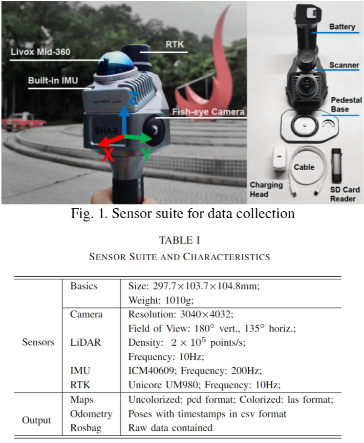
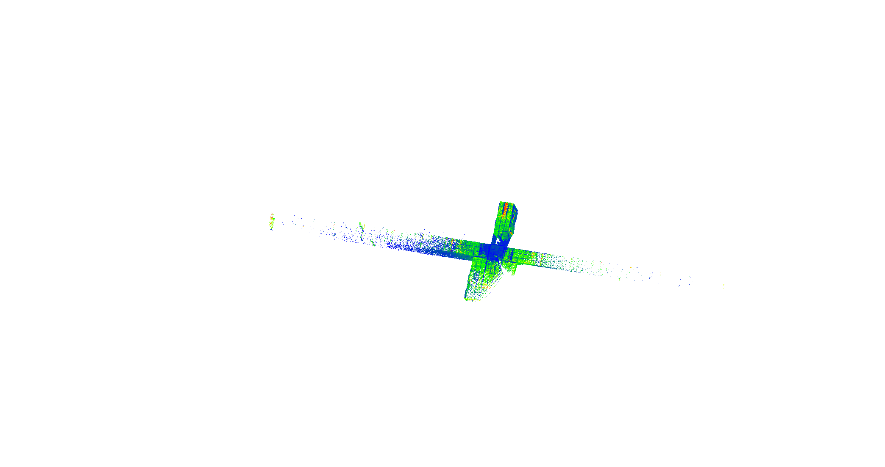

# <div align = "center"> SLABIM: </div>

## <div align = "center">A SLAM-BIM Coupled Dataset in HKUST Main Building</div>

<div align="center">
<a href="https://ieeexplore.ieee.org/document/10518010"></a>
<a href="https://arxiv.org/abs/2308.11573"></a>
<a href="https://youtu.be/4OeZ9bVsxcY?si=180BzZ-lxak1iq69">

</a>
<a ></a>
<a href="https://github.com/HKUST-Aerial-Robotics/G3Reg/issues">

</a>
</div>

> Haoming Huang, [Zhijian Qiao](https://qiaozhijian.github.io/), Zehuan Yu, Chuhao Liu, [Shaojie Shen](https://uav.hkust.edu.hk/group/) and [Huan Yin](https://huanyin94.github.io/)
>
> 2025 IEEE International Conference on Robotics & Automation

### News
* **`15 Sep 2024`:** We submit our paper to [IEEE ICRA](https://2025.ieee-icra.org/).


## Abstract
<div align="center"><h4>SLABIM is the First Open-sourced Dataset that Couples SLAM and BIM.</h4></div>

<div align = "center"> </div>

**Features**:
+ **Large-scale Building Information Modeling**: The BIM model of this dataset is a part of the digital twin project in HKUST, 
featuring various types of offices, classrooms, lounges, and corridors.
+ **Multi-session & Multi-sensor Data**: We collect 12 sessions across different floors and regions. These sessions encompass various indoor scenarios.
+ **Dataset Validation**: To demonstrate the practicality of SLABIM, we test three different tasks: 
(1) LiDAR-to-BIM registration, and (2) Robot pose tracking on BIM and (3) Semantic mapping evaluation
. 
## Download
**Download link will come soon**
<!-- Please visit [SLABIM_Google_Drive]() to check and download data. -->
## Dataset Structure
```
SLABIM
├── BIM
│   └── <X>F
│       ├── CAD
│       │   └── <X>F.dxf
│       └── mesh
│           ├── columns.ply
│           ├── doors.ply
│           ├── floors.ply
│           └── walls.ply
├── calibration_files
│   ├── cam_intrinsics.txt
│   └── cam_to_lidar.txt
└── sensor_data
    └── <X>F_Region<Y>
        ├── images
        │   ├── data
        │   │   └── <frame_id>.png
        │   └── timestamps.txt
        ├── map
        │   ├── data
        │   │   ├── colorized.las
        │   │   └── uncolorized.ply
        │   └── pose_map_to_bim.txt
        ├── points
        │   ├── data
        │   │   └── <frame_id>.pcd
        │   ├── pose_frame_to_bim.txt
        │   └── timestamps.txt
        ├── rosbag
        │   └── data_<x>.bag
        └── submap
            ├── data
            │   └── <submap_id>.pcd
            └── pose_submap_to_bim.txt
```


<!-- ## Multi-session SLAM Dataset
<div align="left">


</div> -->

## Data Acquisition Platform
The handheld sensor suite is illustrated in the Figure 1. A more detailed summary of the characteristics can be found in the Table 1.
<div align="left">


</div>

## Qualitative Results on SLABIM
### Global LiDAR-to-BIM Registration
Global LiDAR-to-BIM registration aims to estimate a transformation from scratch between the LiDAR submap and the BIM coordinate system. A robot can localize itself globally by aligning the online built submap to the BIM. 

<div align = "center"> </div>

### Robot Pose Tracking on BIM
Different from LiDAR-to-BIM, Pose tracking requires estimating poses given the initial state and sequential measurements. 

<div align = "center"> </div>

### Semantic Mapping
we deploy FM-Fusion on SLABIM. For the ground truth, we convert the HKUST BIM into semantic point cloud maps using labeled information. 
<div align = "center"> </div>


## Acknowledgements
We sincerely thank Prof. Jack C. P. Cheng for generously
providing the original HKUST BIM files and Skyland Innovation for the wonderful sensor suite.

We would like to show our greatest respect to authors of the following repos for making their works public:
* [3D-BBS](https://github.com/KOKIAOKI/3d_bbs)

## Citation
If you find SLABIM is useful in your research or applications, please consider giving us a star 🌟 and citing it by the following BibTeX entry.
<!-- ```bibtex
@ARTICLE{qiao2024g3reg,
  author={Qiao, Zhijian and Yu, Zehuan and Jiang, Binqian and Yin, Huan and Shen, Shaojie},
  journal={IEEE Transactions on Automation Science and Engineering}, 
  title={G3Reg: Pyramid Graph-Based Global Registration Using Gaussian Ellipsoid Model}, 
  year={2024},
  volume={},
  number={},
  pages={1-17},
  keywords={Point cloud compression;Three-dimensional displays;Laser radar;Ellipsoids;Robustness;Upper bound;Uncertainty;Global registration;point cloud;LiDAR;graph theory;robust estimation},
  doi={10.1109/TASE.2024.3394519}}
```
```bibtex
@inproceedings{qiao2023pyramid,
  title={Pyramid Semantic Graph-based Global Point Cloud Registration with Low Overlap},
  author={Qiao, Zhijian and Yu, Zehuan and Yin, Huan and Shen, Shaojie},
  booktitle={2023 IEEE/RSJ International Conference on Intelligent Robots and Systems (IROS)},
  pages={11202--11209},
  year={2023},
  organization={IEEE}
}
``` -->
